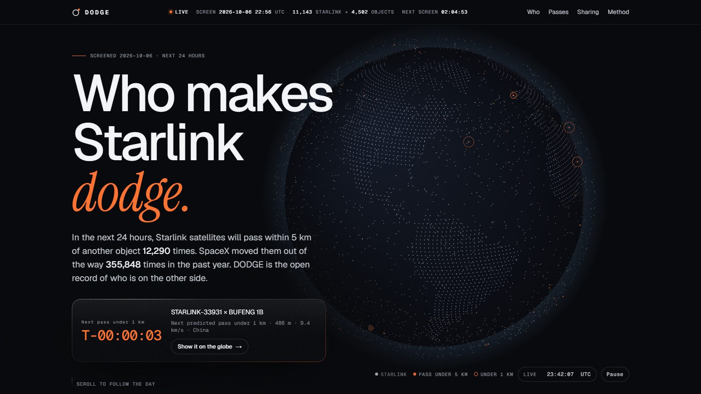
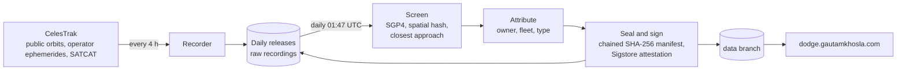

<div align="center">

# DODGE

**Who makes Starlink dodge.**

An open, daily screen of every close approach between Starlink and the rest of low Earth orbit, and who is on the other side.

[**dodge.gautamkhosla.com**](https://dodge.gautamkhosla.com) · [Method](docs/METHOD.md) · [Data](docs/DATA.md) · [Verify](docs/VERIFYING.md) · [Security](SECURITY.md)

[](https://github.com/GautamTalksDev/dodge/actions/workflows/ci.yml)
[](https://github.com/GautamTalksDev/dodge/actions/workflows/screen.yml)
[](https://github.com/GautamTalksDev/dodge/actions/workflows/codeql.yml)
[](https://scorecard.dev/viewer/?uri=github.com/GautamTalksDev/dodge)
[](https://www.bestpractices.dev/projects/15271)
[](LICENSE)
[](LICENSE-DATA)



</div>

## Why

SpaceX told the FCC that Starlink satellites moved out of the way of other objects **355,848 times** between June 2025 and May 2026, about 40 times per satellite. Screening for close approaches is now free and fast: SpaceX's Stargaze, the US government's TraCSS and Space-Track all do it. What nobody publishes is the other half of the story: **which objects and operators cause the risk, who shares where their satellites are, and who leaves hardware behind.**

DODGE is that public record, rebuilt every day from public data, by code anyone can read and rerun.

## What one day looks like

The first screen, started 6 October 2026 22:56 UTC, covering the next 24 hours:

| | |
|---|---|
| Starlink satellites screened | 11,143 |
| Other objects crossing their altitudes | 4,502 |
| Predicted passes under 5 km | 12,290 |
| Under 1 km | 431 |
| Closest | 50 m, STARLINK-30376 and a Chinese CZ-2D rocket body, closing at 13.9 km/s |

Three things stand out:

* **Per object, Chinese and US hardware come close at the same rate** (2.77 and 2.67 passes per object per day). Raw totals mostly follow how much hardware sits at Starlink's altitudes.
* **Objects with no registered owner come close most often:** 6.48 passes per object. Many are recent rideshare deployments still waiting to be identified, including some from SpaceX's own Transporter missions.
* **About one pass in six involves a spent rocket stage or debris,** hardware nobody can steer.

## How it works



1. **Record.** Every 4 hours, GitHub Actions downloads CelesTrak's public element sets: active satellites, analyst objects, recent launches, all debris, all rocket bodies, and the operator-published ephemerides for Starlink and ten other fleets. CelesTrak keeps only the latest orbit for each object, so DODGE keeps the history.
2. **Screen.** Once a day, every object is propagated with SGP4 for 24 hours on a 10 second grid. A spatial hash finds every Starlink pair closer than 100 km, a straight-line fit finds the moment of closest approach, and SGP4 at 50 ms refines it. Passes under 5 km are kept. Details: [METHOD.md](docs/METHOD.md).
3. **Attribute.** Each pass is joined with the satellite catalog: owner, object type, fleet, launch, and whether the operator publishes its orbits.
4. **Seal and sign.** Every day's files get a SHA-256 manifest that names the previous day's manifest, and a Sigstore attestation from this repository's workflow. Details: [SECURITY_PRACTICES.md](docs/SECURITY_PRACTICES.md).
5. **Publish.** The website reads the latest files; everything else is in the [releases](https://github.com/GautamTalksDev/dodge/releases).

## Is it right?

| Check | Result |
|---|---|
| Fast screen against a brute force search, every pair every second, on real data | 80 of 80 passes found, none missed |
| Spatial hash against a full distance matrix | Identical pairs, including points on cell edges |
| Kinetic gas estimate of the pass rate | about 600 per hour predicted, 512 per hour found |
| Against SpaceX's maneuver count | about 157,000 passes under 1 km a year against 355,848 maneuvers at a more cautious probability threshold: same order of magnitude |

Full detail and limits: [VALIDATION.md](docs/VALIDATION.md).

**What the numbers are not.** They are screening grade, from public orbit data that is typically good to about a kilometre. They are not collision probabilities and must not be used for collision avoidance. Most passes involve small satellites without propulsion or old hardware, which are where physics puts them. DODGE measures exposure and transparency, not blame.

## Get the data

| What | Where |
|---|---|
| Latest summary | [`latest.json`](https://raw.githubusercontent.com/GautamTalksDev/dodge/data/latest.json) on the `data` branch |
| Every pass under 5 km, by day | `events-YYYY-MM-DD.json.gz` in the [releases](https://github.com/GautamTalksDev/dodge/releases) |
| Raw orbit recordings | `gp-YYYY-MM-DD.ndjson.gz` in the same releases |
| Field by field reference | [DATA.md](docs/DATA.md) |

Check that what you downloaded is genuine: [VERIFYING.md](docs/VERIFYING.md).

## Run it yourself

```bash
git clone https://github.com/GautamTalksDev/dodge.git && cd dodge
python3 -m venv .venv && .venv/bin/pip install --require-hashes --no-deps -r requirements.txt
.venv/bin/python -m unittest discover -s tests -p "test_*.py"
gh release download day-2026-10-07 -D work -p "gp-*" -p "satcat-*" -p "supgp-sources-*"
.venv/bin/python engine/daily.py work out
```

Two dependencies, both pinned with hashes: [`sgp4`](https://pypi.org/project/sgp4/) (David Vallado's reference SGP4, wrapped by Brandon Rhodes) and `numpy`. The website is plain HTML, CSS and JavaScript with no build step.

## Security

The site runs under a strict Content Security Policy with Trusted Types, and has no cookies, accounts or server. Workflows run with least privilege, every action is pinned to a commit SHA, and the jobs that touch third-party code cannot write. Published data is hash-chained and signed. Report vulnerabilities privately: [SECURITY.md](SECURITY.md). Threat model: [THREAT_MODEL.md](docs/THREAT_MODEL.md).

## Documentation

| Document | What it covers |
|---|---|
| [ARCHITECTURE.md](docs/ARCHITECTURE.md) | Components, data flow, sequence of a daily run, repository layout |
| [METHOD.md](docs/METHOD.md) | Inputs, selection, propagation, screening math, attribution, limits |
| [VALIDATION.md](docs/VALIDATION.md) | How we know the screen finds what is there |
| [DATA.md](docs/DATA.md) | Every published file and field |
| [VERIFYING.md](docs/VERIFYING.md) | Check hashes, the chain, attestations; reproduce a screen |
| [SECURITY_PRACTICES.md](docs/SECURITY_PRACTICES.md) | Controls mapped to OWASP CI/CD Top 10, ASVS, Scorecard and SLSA |
| [THREAT_MODEL.md](docs/THREAT_MODEL.md) | STRIDE and the OWASP Top 10:2025 mapping |
| [CONTRIBUTING.md](CONTRIBUTING.md) · [GOVERNANCE.md](GOVERNANCE.md) · [CHANGELOG.md](CHANGELOG.md) | How to help, how decisions are made, what changed |

## Credit and licences

* **Code:** [MIT](LICENSE).
* **DODGE's derived data** (passes, summaries, replay): [CC BY 4.0](LICENSE-DATA). Credit "DODGE (dodge.gautamkhosla.com)".
* **Orbit data:** [CelesTrak](https://celestrak.org), run by Dr T.S. Kelso. Starlink and other operator positions come from the operators' own published ephemerides through CelesTrak SupGP. DODGE does not use Space-Track data.
* **Cite:** see [CITATION.cff](CITATION.cff), or use "Cite this repository" on GitHub.

DODGE is independent. It is not affiliated with SpaceX, Starlink or any operator named in it.
