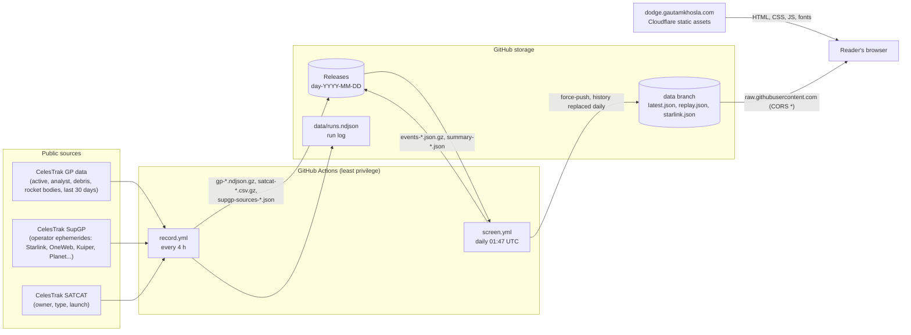
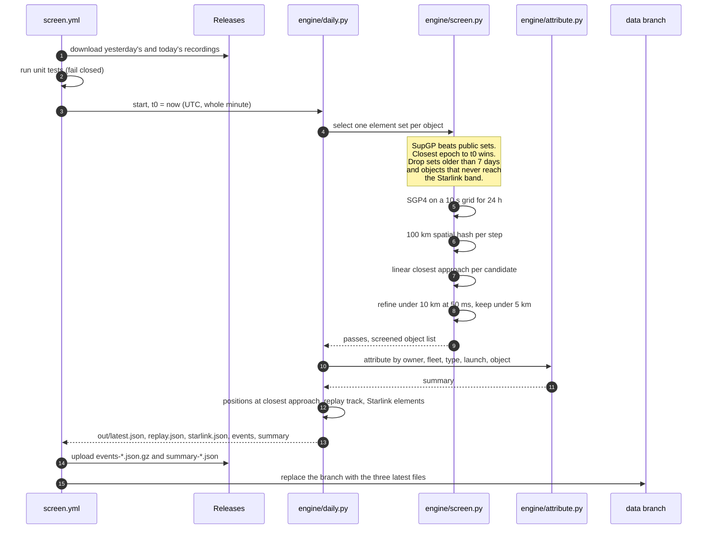

# Architecture

DODGE has four parts. None of them runs a server, holds a user account or stores personal data.

| Part | Where it runs | What it does |
|---|---|---|
| Recorder | GitHub Actions, every 4 hours | Downloads public orbit data from CelesTrak and keeps every new element set, because CelesTrak only serves the latest one |
| Screen | GitHub Actions, once a day | Predicts every pass under 5 km between Starlink and everything else for the next 24 hours, then attributes each pass |
| Data publication | GitHub Releases and the `data` branch | Daily archive (releases) and the latest files the site reads (`data` branch) |
| Website | Cloudflare Workers static assets | A static page that reads the latest files from the `data` branch |

## System overview



## The daily screen, step by step



## Repository layout

```
.github/workflows/   record.yml (recorder), screen.yml (screen, seal, sign), ci.yml, codeql.yml,
                     zizmor.yml, scorecard.yml, dependency-review.yml
recorder/record.py   downloads and deduplicates element sets; standard library only
engine/screen.py     selection, SGP4 propagation, spatial hash, closest approach, refinement
engine/attribute.py  joins passes with the SATCAT; owner, fleet, type, launch, object tables
engine/fleets.py     name patterns for fleets and which SupGP file would carry their ephemerides
engine/owners.json   SATCAT owner codes to display names
engine/daily.py      the daily run: screen, attribute, publish
tests/               unit tests (spatial hash, crafted crossing) and the recall check
tools/manifest.py    daily SHA-256 manifest, chained to the previous day
tools/verify.py      offline check of manifests and the chain
site/public/         the website: index.html, method/, app.js, globe.js, styles.css, _headers
site/build/          build helpers (land dots for the globe)
docs/                this documentation
data/runs.ndjson     one line per recorder run: sources, HTTP status, counts
```

## Why the data lives where it does

* **Releases** hold the archive. Each UTC day gets one release, `day-YYYY-MM-DD`, with the raw recordings and that day's results. Git history stays small and the archive is permanent.
* **The `data` branch** holds only the three files the website needs. It is replaced every day with a fresh single commit, so it never grows. The site reads it from `raw.githubusercontent.com`, which allows cross-origin reads.
* **`main`** holds code, docs and the small run log. Nothing large is committed to it.

## Design constraints

* **Public data only.** DODGE never uses Space-Track: its user agreement forbids passing on analysis without Department of Defense approval.
* **Gentle on CelesTrak.** At most one download per source per run, every 4 hours, well under the 250 MB per day limit. A 403 ("not updated since your last download") is skipped, never retried.
* **No server.** There is nothing to log in to and nothing to break into on the website. All computation happens in GitHub Actions, in the open.
* **Reproducible.** Every input is kept in the releases, the engine is deterministic for a given start time, and the dependencies are pinned. See [VERIFYING.md](VERIFYING.md).
