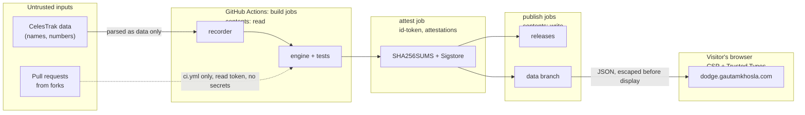

# Threat model

Method: STRIDE over the data flow, plus misuse. Reviewed 2026-10-07. It is reviewed again whenever a workflow, a data source or the website's loading model changes.

## What we protect

| Asset | Why it matters |
|---|---|
| Published data (releases, `data` branch) | People cite it. A silent change would mislead them and discredit the project |
| The website | Visitors run its code. It must not become a way to attack them |
| The workflows and their tokens | They write releases and the `data` branch |
| The maintainer's accounts (GitHub, Cloudflare) | They control everything above |

## Trust boundaries

## STRIDE

| Threat | Example | Controls | Residual risk |
|---|---|---|---|
| **Spoofing** | A fake mirror or forged release claims to be DODGE data | Sigstore attestations tied to this repository's workflow (`gh attestation verify --repo`); HTTPS with HSTS on the site | Readers who never verify. Mitigated by [VERIFYING.md](VERIFYING.md) and by publishing checksums next to the data |
| **Tampering: supply chain** | A compromised GitHub Action (like `tj-actions/changed-files` in March 2025) or a malicious PyPI release | Every action pinned to a full commit SHA; Python dependencies installed with `--require-hashes --no-deps`; Dependabot with a 7 day cooldown; harden-runner network audit; zizmor and CodeQL on workflows | A malicious change in a pinned dependency we update to. Reviewed on each Dependabot PR |
| **Tampering: published data** | Someone with write access edits a past release | SHA-256 manifest per day, each naming the hash of the previous day's manifest; manifests and outputs attested with Sigstore (Rekor transparency log) | The maintainer's own account. See "Elevation" |
| **Tampering: upstream data** | CelesTrak serves malformed or hostile strings | Recorder keeps a fixed set of fields; engine parses numbers only; names reach the page only through escaping and a Trusted Types policy | Bad numbers produce bad predictions. Tests and validation catch gross errors, not subtle ones |
| **Repudiation** | "DODGE never published that" | Rekor transparency log entries for each attestation; git history; run log in `data/runs.ndjson` | None significant |
| **Information disclosure** | A token leaks in logs; visitor IPs collected | No long-lived secrets in workflows (only the short-lived `GITHUB_TOKEN`); `persist-credentials: false`; secret scanning with push protection; no cookies or accounts; privacy page discloses that GitHub serves the data files | GitHub and Cloudflare see visitor IPs, as any host would |
| **Denial of service** | CelesTrak blocks the runner IPs; the scheduled workflows get disabled after 60 days without commits | One request per source per run, stop on any unexpected status, no retries; the recorder commits a run log every 4 hours, which keeps the repository active | A long CelesTrak outage leaves a gap in the archive. Gaps are visible in the run log |
| **Elevation of privilege** | A fork pull request runs with write access (`pull_request_target`); script injection through `${{ }}` in `run:` | No `pull_request_target` or `workflow_run`; inputs reach shell only through `env:` and are validated; top-level `permissions: {}`; jobs that run third-party code hold read-only tokens | Maintainer account takeover. Mitigated by passkey 2FA on GitHub and Cloudflare |
| **Misuse** | Someone treats DODGE predictions as operational collision warnings | "Screening grade, not collision probability" on every page that shows a pass; method and validation published | Cannot be fully prevented. Wording is deliberate |

## OWASP Top 10:2025 mapping

| Category | Where it applies | Control |
|---|---|---|
| A01 Broken Access Control | Workflow tokens, repository settings | Least-privilege permissions per job; rulesets on `main` |
| A02 Security Misconfiguration | Site headers, Actions settings | Strict CSP, Trusted Types, full header set; read-only default token |
| A03 Software Supply Chain Failures | Actions, PyPI, fonts | SHA pins, hashed requirements, self-hosted fonts, Scorecard, Dependabot |
| A04 Cryptographic Failures | Integrity of data | SHA-256 manifests and checksums, Sigstore signing, TLS everywhere |
| A05 Injection | DOM XSS from data, workflow script injection | Escaping, Trusted Types policy `dodge`, no `${{ }}` in `run:`, zizmor |
| A06 Insecure Design | Overall | This threat model, job separation, fail closed |
| A07 Authentication Failures | Maintainer accounts | Passkey 2FA; no user accounts exist |
| A08 Software or Data Integrity Failures | Releases, `data` branch | Chained manifests, attestations, verification guide |
| A09 Security Logging and Alerting Failures | Workflows | Run log, workflow failure notifications, harden-runner egress log |
| A10 Mishandling of Exceptional Conditions | CelesTrak errors, partial data | Stop on unexpected status, tests gate publishing, stale-data banner on the site |
